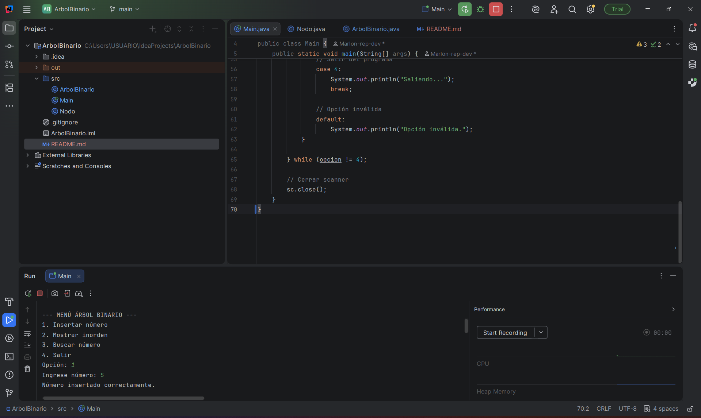
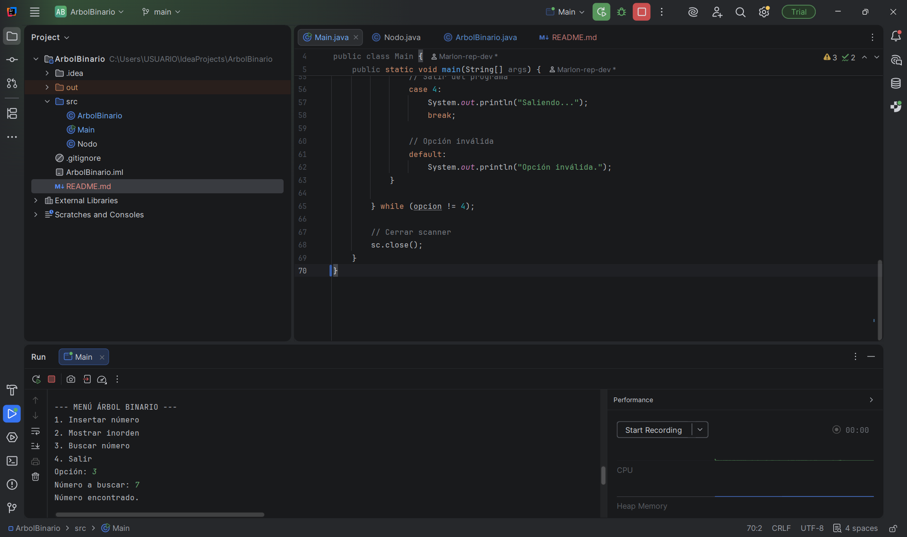

# 🌳 Árbol Binario en Java

##  Descripción

Este proyecto es un programa en Java donde se implementa un árbol binario.

El programa permite:

* Insertar números
* Ver los números ordenados
* Buscar un número

---

##  ¿Qué es un árbol binario?

Un árbol binario es una forma de organizar datos.

Cada nodo puede tener:

* Un hijo a la izquierda
* Un hijo a la derecha

Los números menores van a la izquierda y los mayores a la derecha.

---

## Recorrido inorden

Sirve para mostrar los números en orden.

Ejemplo:

Si ingresamos:
5, 3, 7

Resultado:
3 5 7

---

## ⚙ ¿Cómo funciona?

El programa tiene 3 partes:

* Nodo: guarda los datos
* ArbolBinario: tiene la lógica
* Main: muestra el menú

---

##  Ejemplo de ejecución

--- MENÚ ÁRBOL BINARIO ---

1. Insertar número
2. Mostrar inorden
3. Buscar número
4. Salir

Ingrese número: 5
Ingrese número: 3
Ingrese número: 7

Recorrido inorden:
3 5 7

Número encontrado.

---

##  Integrantes

* Marlon Rodríguez

---

##  Conclusión

Con este trabajo aprendimos cómo funciona un árbol binario y cómo organizar datos usando Java.

## Evidencia

### Metiendo datos

### Recorrido inorden

### Búsqueda
